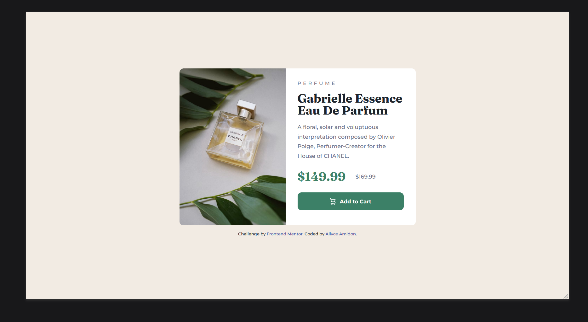

# Frontend Mentor - Product preview card component solution

This is a solution to the [Product preview card component challenge on Frontend Mentor](https://www.frontendmentor.io/challenges/product-preview-card-component-GO7UmttRfa). Frontend Mentor challenges help you improve your coding skills by building realistic projects. 

## Table of contents

- [Overview](#overview)
  - [The challenge](#the-challenge)
  - [Screenshot](#screenshot)
  - [Links](#links)
- [My process](#my-process)
  - [Built with](#built-with)
  - [What I learned](#what-i-learned)
  - [Continued development](#continued-development)
  - [Useful resources](#useful-resources)
- [Author](#author)

## Overview

### The challenge

Users should be able to:

- View the optimal layout depending on their device's screen size
- See hover and focus states for interactive elements

### Screenshot




### Links

- Solution URL: [https://github.com/amidona/product-preview-card](https://github.com/amidona/product-preview-card)

## My process

### Built with

- Semantic HTML5 markup
- CSS custom properties
- Flexbox
- Mobile-first workflow
- [React](https://reactjs.org/) - JS library


### What I learned

I worked out how all the component pieces for the button mouseover effect worked, things I'd known separately but never put together:

```css
.shadow {
    background-color: hsl(158, 37%, 19%);
    cursor: pointer;
}
```
```js
const button = document.querySelector("button");
button.addEventListener("mouseover", function() {
    button.classList.add("shadow");
});
button.addEventListener("mouseout", function () {
    button.classList.remove("shadow");
});
```

I also figured out how to replace one image with another just using CSS without having to use JS.

```css
@media (min-width: 630px) {
    .hero img {
        content: url(images/image-product-desktop.jpg);
    }
}
```

### Continued development

I'm not entirely happy with where my mobile/tablet to desktop transition points ended up. If I was going to spend more time on this project, I'd monkey around with a separate tablet media query, even if it wasn't required in the brief. The .text block didn't want to scale with the figure (maybe a font size issue?), and what I've ended up with works, but not as gracefully as I'd like.

### Useful resources

- [W3 Schools List of Mouse Cursors](https://www.w3schools.com/cssref/pr_class_cursor.php)
- [Change Background Color on Mouse Hover in JavaScript](https://www.codespeedy.com/change-background-color-on-mouse-hover-in-javascript/) - I couldn't remember how to get the effect to end once the mouse left the button, and voila, Mollick's code had the answer
- [Scott Kellum](https://codepen.io/scottkellum/pen/nZLMdw) - for the code to replace one image with another directly in CSS instead of having to use JS


## Author

- Website - [Allyce Amidon](https://allyceamidon.com/)
- GitHub - [@amidona](https://github.com/amidona)
